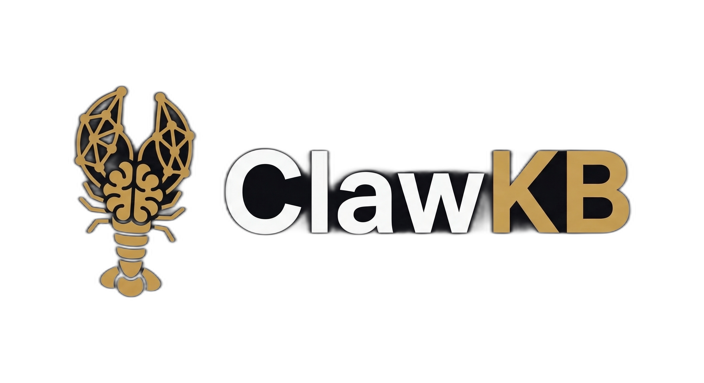
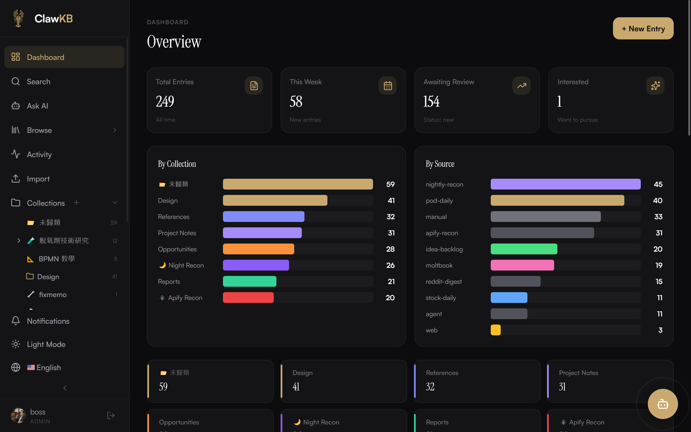
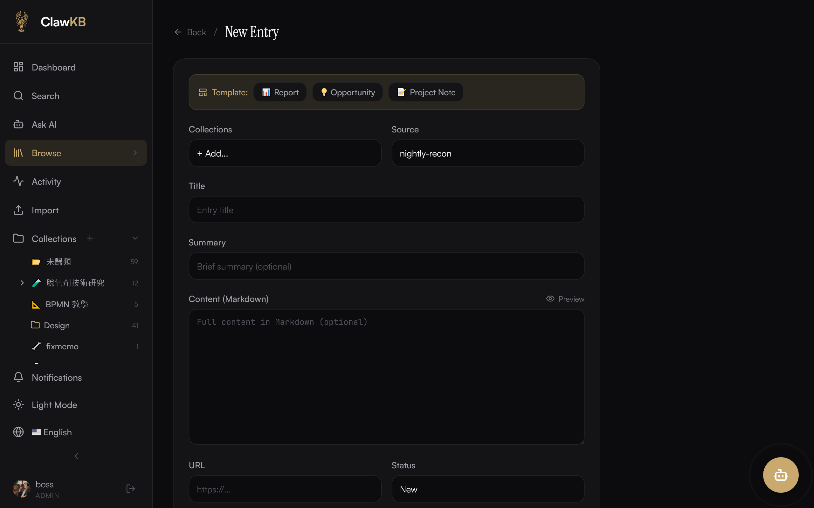
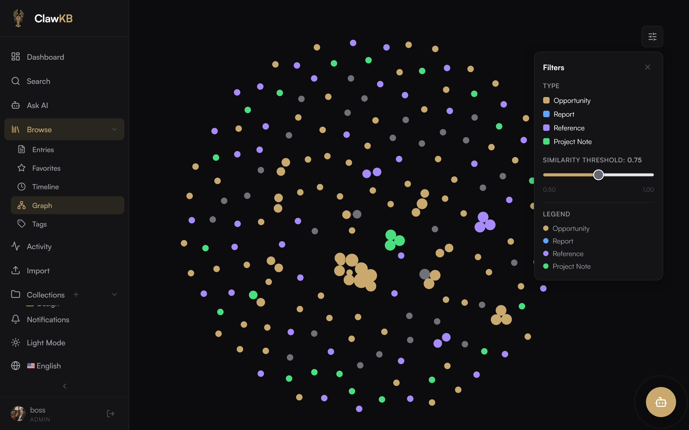
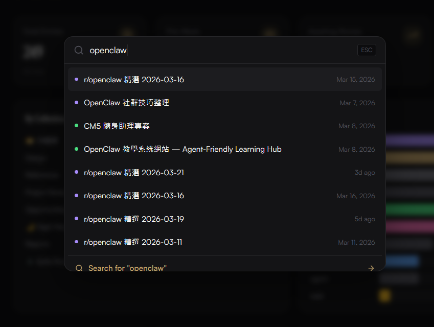
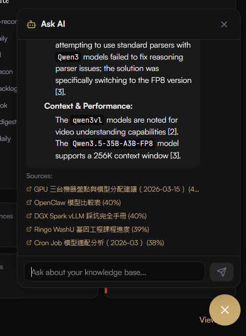
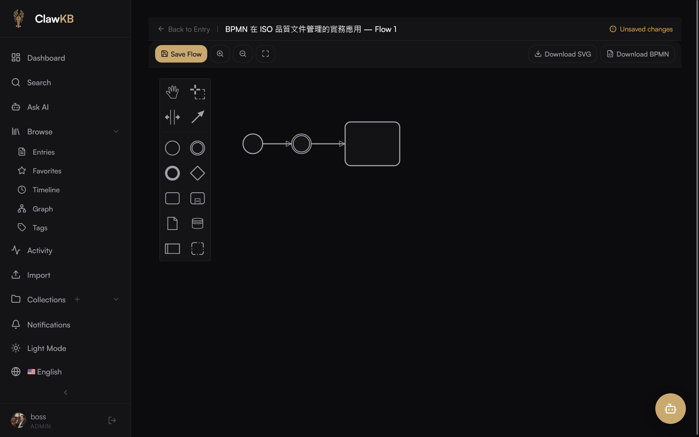
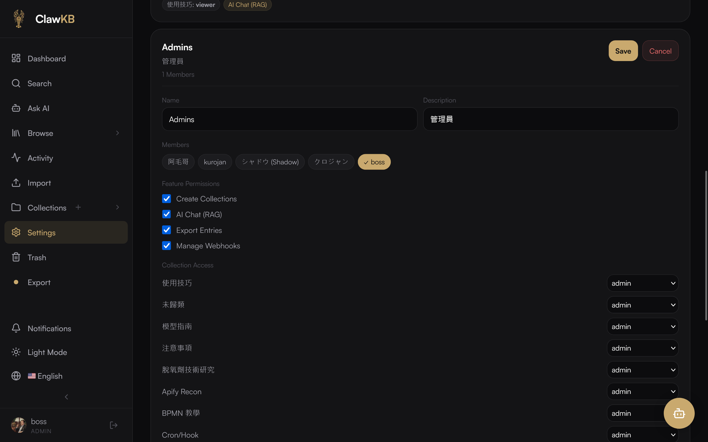
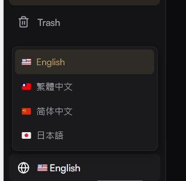

<p align="center">
  
</p>

# ClawKB

**A knowledge base built for Human–AI Agent collaboration.**

ClawKB lets humans and AI agents co-create, search, and manage knowledge entries through a clean web UI and a headless API. Designed for the [OpenClaw](https://github.com/openclaw/openclaw) ecosystem but works standalone.

English | [简体中文](./README.zh-CN.md) | [繁體中文](./README.zh-TW.md) | [日本語](./README.ja.md)

## Screenshots

| Dashboard | Entry Editor | Knowledge Graph |
|:-:|:-:|:-:|
|  |  |  |

| Search (⌘K) | Ask AI (RAG) | BPMN Flow Editor |
|:-:|:-:|:-:|
|  |  |  |

| ACL Settings | Language Switcher |
|:-:|:-:|
|  |  |

## Features

### Core — Entries
- 📝 **Rich Editor** — TipTap markdown editor with live preview
- 📂 **Collections** — Hierarchical folder tree; entries can belong to multiple collections
- 🏷️ **Tags & Status Tracking** — Filter, organize, and track entry lifecycle (new → interested → in_progress → done / dismissed)
- 🔗 **Internal Links** — `[[entry:ID|title]]` Notion-style mentions with `[[` trigger search menu
- 🖼️ **Image Attachments** — Upload via any S3-compatible storage (MinIO, AWS S3, R2)
- 📋 **Metadata (JSON)** — Custom JSON metadata per entry

### Search & Discovery
- 🔍 **Hybrid Search** — Vector (pgvector) + fuzzy (ILIKE) cascading pipeline
- ⌘ **Quick Search** — `⌘K` global search modal
- 🕸️ **Knowledge Graph** — Interactive d3-force visualization at `/graph`
- 📅 **Timeline** — Chronological entry view at `/timeline`
- 🔙 **Backlinks** — Bi-directional link detection
- 🧲 **Related Entries** — Semantically similar entry recommendations via embeddings

### Collaboration
- 👥 **Multi-user Auth** — NextAuth.js sessions, registration + login
- 🔒 **Registration Flow** — Configurable admin approval + email verification; specific login error messages for unverified/unapproved/rejected accounts
- 🛡️ **ACL Permission System** — Group-based collection access control; each collection can be restricted to specific groups with admin/editor/viewer roles; built-in groups: "Everyone" (all including anonymous) and "Users" (all registered); effective role = highest across all user's groups; `User.isAdmin` bypasses all ACL
- 🔐 **Feature Permissions** — Groups have boolean toggles: canCreateCollections, canUseRag, canExport, canManageWebhooks; UI elements hidden + API returns 403 when not permitted
- 👤 **User Management** — Admin can delete users with entry transfer (reassign entries to another user) or cascade delete; entry/comment counts shown
- 📧 **SMTP Email** — Gmail / custom SMTP, password reset flow, notification email delivery
- ⏱️ **Forgot Password Rate Limiting** — 3 requests per email per 15 minutes
- 🔔 **Notifications** — In-app notification bell with SSE real-time push, unread badge, mark-as-read
- 💬 **Comments** — Per-entry discussion threads
- 📜 **Revision History** — Auto-versioning with inline diff viewer; compare any two revisions or diff against current live content
- 📊 **Activity Log** — Automatic CRUD + comment action logging at `/activity`; non-admin users only see activity for entries in collections they can access
- ⭐ **Favorites** — Star entries for quick access at `/favorites`
- 🗑️ **Soft Delete & Trash** — Trash with restore and permanent delete (admin)
- 🔗 **Share Links** — Time-limited, password-protected sharing for external access without login

### AI & Agent Integration
- 🤖 **Agent-friendly REST API** — 30+ endpoints with Bearer token auth
- 🔑 **Per-user API Tokens** — Create and revoke multiple tokens per user
- 📡 **Agent Registration** — Programmatic agent account creation via `/api/auth/register-agent`
- 🧠 **RAG Query (Ask AI)** — `/api/rag` endpoint: vector retrieve → LLM synthesize with SSE streaming; chat UI at `/rag` with source citations
- 🔔 **Webhooks** — HMAC-SHA256 signed event delivery with 3× exponential backoff retry; events: entry.created/updated/deleted/restored, comment.created
- 🔌 **Gateway Auto-Recall** — OpenClaw Gateway plugin for automatic RAG injection into agent conversations, with sender-based ACL (owner full recall / public sender limited to public collections / unauthorized zero recall)
- 🐾 **[OpenClaw Skill + Plugin](https://github.com/hata1234/clawkb-openclaw)** — Install the companion skill to let your OpenClaw agent read, search, and write ClawKB entries directly from chat

### Import & Export
- 📥 **Import** — Batch import from Markdown (.md), JSON, or CSV files with drag-and-drop UI, preview table, duplicate detection (skip/overwrite/create new); requires selecting a target collection; only writable collections shown; backend validates write permission
- 📤 **Export** — CSV, JSON, Markdown, and PDF formats with filter options
- 📄 **PDF Export** — Formatted PDF with markdown rendering (headers, lists, tables, code blocks), CJK support (auto-downloads Noto Sans TC font), optional password encryption

### Plugin System
- 🔌 **File-based plugins** — `plugins/` directory with `manifest.json` + `server.mjs`
- Hooks: `entry.serialize`, `entryCard.render`, `entry.afterQuery`
- Built-in: backlinks, related-entries, auto-tag, entry-templates, export
- Content Tags hook (`content.tags`) — plugins can register `{{tag:value}}` syntax for inline rendering

### BPMN Flow Designer
- 🔀 **BPMN Flow Designer** — bpmn-js based flow designer with full-screen editor
- 📎 **EntryFlow Attachments** — Multiple flows per entry
- 🔗 **Inline Rendering** — Embed flows via `{{flow:ID}}` syntax

### Document Numbers
- 🔢 **Auto-generated Document Numbers** — Collection prefix + sequential counter (e.g. `QP-001`)

### Internationalization
- 🌐 **i18n** — 4 languages: English, 繁體中文, 简体中文, 日本語 (via next-intl)
- 🔤 **Language Switcher** — In-app sidebar language selector with flag emojis
- 🔗 **Locale Routing** — `/en/`, `/zh-TW/`, `/zh-CN/`, `/ja/` URL prefix routing

### UI
- 🌙 **Dark Theme** — Editorial dark UI, responsive on mobile and desktop
- 📊 **Dashboard** — Stats overview with charts and recent entries
- ⚙️ **Settings** — Configure entry types, embedding, object storage, users, plugins, permissions, webhooks, RAG, and more

## Tech Stack

| Layer | Choice |
|-------|--------|
| Framework | Next.js 16 (App Router) |
| Database | PostgreSQL 17+ with [pgvector](https://github.com/pgvector/pgvector) |
| ORM | Prisma |
| Embedding | Configurable — Ollama (bge-m3, nomic-embed, etc.), OpenAI, or any compatible endpoint |
| Auth | NextAuth.js (Credentials) |
| Object Storage | Any S3-compatible (MinIO, AWS S3, Cloudflare R2, etc.) |
| Styling | Tailwind CSS + CSS variables |
| Process Manager | PM2 |

## Quick Start

### Prerequisites

- Node.js 20+
- PostgreSQL 17+ with [pgvector](https://github.com/pgvector/pgvector) extension
- An embedding provider (Ollama, OpenAI, or compatible endpoint)

### Install

```bash
git clone https://github.com/openclaw/clawkb.git
cd clawkb

npm install

# Set up environment
cp .env.example .env
# Edit .env with your database URL, auth secret, etc.

# Run migrations
npx prisma migrate deploy

# Seed initial user
npm run seed

# Build & start
npm run build
npm start
```

### Docker

```bash
git clone https://github.com/openclaw/clawkb.git
cd clawkb

# (Optional) set secrets in .env — docker-compose reads from it
cp .env.example .env

docker compose up -d
# App at http://localhost:3500  (default user: admin / change-me-on-first-login)
```

### Environment Variables

| Variable | Description | Example |
|----------|-------------|---------|
| `DATABASE_URL` | PostgreSQL connection string | `postgresql://user@localhost:5432/clawkb` |
| `NEXTAUTH_SECRET` | Session encryption secret | (random string) |
| `NEXTAUTH_URL` | Public URL | `https://kb.example.com` |
| `API_TOKEN` | Global bearer token for agent API access | (random string) |
| **Embedding** | | |
| `EMBEDDING_PROVIDER` | Provider type | `ollama` or `openai` |
| `EMBEDDING_URL` | Embedding API endpoint | `http://localhost:11434` |
| `EMBEDDING_MODEL` | Model name | `bge-m3` or `text-embedding-3-small` |
| `EMBEDDING_API_KEY` | API key (required for OpenAI) | `sk-...` |
| **Object Storage (S3-compatible)** | | |
| `S3_ENDPOINT` | S3-compatible endpoint | `minio.example.com` or `s3.amazonaws.com` |
| `S3_ACCESS_KEY` | Access key | |
| `S3_SECRET_KEY` | Secret key | |
| `S3_BUCKET` | Bucket name | `clawkb` |
| `S3_PUBLIC_URL` | Public URL prefix for uploaded files | `https://minio.example.com/clawkb` |
| `S3_REGION` | Region (required for AWS S3) | `us-east-1` |

## Settings

ClawKB includes a built-in Settings page (`/settings`) where you can configure:

- **Entry Types** — Add, rename, or remove entry type categories
- **Collections** — Manage hierarchical folder structure
- **Embedding** — Switch between Ollama, OpenAI, or other providers; change model; rebuild embeddings
- **Object Storage** — Configure S3-compatible storage connection
- **Users** — Manage users and role groups (admin)
- **Permissions** — Fine-grained ACL with custom groups
- **API Tokens** — Create per-user API tokens for agent access
- **Plugins** — Enable/disable and configure plugins
- **Webhooks** — Manage webhook endpoints and view delivery history
- **RAG / AI** — Configure LLM provider for Ask AI feature

## API

All API endpoints are under `/api/`. Access requires either a session cookie or `Authorization: Bearer <token>` header (global `API_TOKEN` or per-user token).

| Method | Endpoint | Description |
|--------|----------|-------------|
| **Entries** | | |
| `GET` | `/api/entries` | List entries (filter by type, status, tags; pagination) |
| `POST` | `/api/entries` | Create entry (auto-generates embedding) |
| `GET` | `/api/entries/[id]` | Get single entry |
| `PATCH` | `/api/entries/[id]` | Update entry fields |
| `DELETE` | `/api/entries/[id]` | Soft-delete entry |
| **Search** | | |
| `POST` | `/api/search` | Hybrid search (vector + fuzzy) |
| **RAG** | | |
| `POST` | `/api/rag` | RAG query — vector retrieve → LLM synthesize (supports SSE streaming) |
| **Collections** | | |
| `GET` | `/api/collections` | List collections tree |
| `POST` | `/api/collections` | Create collection |
| `PATCH` | `/api/collections/[id]` | Update collection |
| `DELETE` | `/api/collections/[id]` | Delete collection |
| **Comments** | | |
| `GET` | `/api/entries/[id]/comments` | List comments on entry |
| `POST` | `/api/entries/[id]/comments` | Add comment |
| **Import** | | |
| `POST` | `/api/import` | Batch import entries (Markdown, JSON, CSV) |
| **Webhooks** | | |
| `GET` | `/api/webhooks` | List webhooks |
| `POST` | `/api/webhooks` | Create webhook |
| `PATCH` | `/api/webhooks/[id]` | Update webhook |
| `DELETE` | `/api/webhooks/[id]` | Delete webhook |
| `GET` | `/api/webhooks/[id]/deliveries` | Webhook delivery history |
| **Favorites** | | |
| `GET` | `/api/favorites` | List starred entries |
| `POST` | `/api/favorites` | Toggle star on entry |
| **Activity** | | |
| `GET` | `/api/activity` | Activity feed |
| **Trash** | | |
| `GET` | `/api/trash` | List soft-deleted entries |
| `POST` | `/api/trash` | Restore or permanently delete |
| **Graph** | | |
| `GET` | `/api/graph` | Knowledge graph data |
| **Users & Tokens** | | |
| `GET` | `/api/users` | List users (admin) |
| `GET` | `/api/tokens` | List API tokens |
| `POST` | `/api/tokens` | Create API token |
| `DELETE` | `/api/tokens/[id]` | Revoke token |
| **Plugins** | | |
| `GET` | `/api/plugins` | List installed plugins |
| `PATCH` | `/api/plugins/[id]` | Enable/disable plugin |
| **Other** | | |
| `GET` | `/api/stats` | Dashboard statistics |
| `GET` | `/api/tags` | List all tags |
| `GET` | `/api/settings` | Get current settings |
| `PATCH` | `/api/settings` | Update settings |

### Example: Create an Entry

```bash
curl -X POST http://localhost:3500/api/entries \
  -H "Content-Type: application/json" \
  -H "Authorization: Bearer YOUR_API_TOKEN" \
  -d '{
    "type": "opportunity",
    "source": "nightly-recon",
    "title": "New POD platform discovered",
    "summary": "A brief summary",
    "content": "Full markdown content here...",
    "status": "new",
    "tags": ["pod", "automation"]
  }'
```

### Example: Search

```bash
curl -X POST http://localhost:3500/api/search \
  -H "Content-Type: application/json" \
  -H "Authorization: Bearer YOUR_API_TOKEN" \
  -d '{"query": "passive income automation"}'
```

### Example: Ask AI (RAG)

```bash
curl -X POST http://localhost:3500/api/rag \
  -H "Content-Type: application/json" \
  -H "Authorization: Bearer YOUR_API_TOKEN" \
  -d '{"query": "What do we know about DGX Spark setup?", "stream": true}'
```

### Example: Import

```bash
# JSON import
curl -X POST http://localhost:3500/api/import \
  -H "Authorization: Bearer YOUR_API_TOKEN" \
  -F 'files=@entries.json'

# Markdown import (multiple files)
curl -X POST http://localhost:3500/api/import \
  -H "Authorization: Bearer YOUR_API_TOKEN" \
  -F 'files=@note1.md' -F 'files=@note2.md'
```

## Architecture

```
Browser/Mobile → Reverse Proxy (Caddy/Nginx) → Next.js :3500 → PostgreSQL + pgvector
                                                    ↑                    ↑
                                              AI Agent / Cron    Embedding Provider
                                              (REST API)         (Ollama / OpenAI)
                                                    ↓
                                              Plugin System
                                              (backlinks, auto-tag, templates, export, ...)

OpenClaw Gateway ──(clawkb-recall plugin)──→ ClawKB API
                                              ↓
                                         Auto-RAG injection
                                         into agent conversations
```

## Plugins

ClawKB supports a file-based plugin system. Plugins live in the `plugins/` directory and can hook into:

| Hook | Description |
|------|-------------|
| `entry.serialize` | Modify API response before sending |
| `entryCard.render` | Add badges/icons/indicators to entry cards |
| `entry.afterQuery` | Post-process batch queries |

### Built-in Plugins

| Plugin | Description |
|--------|-------------|
| `backlinks` | Scans `#id` and `/entries/id` references to build bi-directional links |
| `related-entries` | Finds semantically similar entries via embeddings |
| `auto-tag` | Suggests tags based on entry content |
| `entry-templates` | Predefined templates for common entry types |
| `export` | CSV, JSON, Markdown, and PDF export with CJK support and optional encryption |

## Roadmap

### ✅ Completed
- [x] ACL permission system (group-based collection access with admin/editor/viewer roles + feature permission toggles per group)
- [x] Revision diff viewer (inline diff + Current live comparison)
- [x] RAG query endpoint + Ask AI chat UI with streaming
- [x] Webhooks with HMAC-SHA256 signed delivery
- [x] PDF export with CJK support and password encryption
- [x] Import (Markdown / JSON / CSV batch import with preview UI)
- [x] i18n — 4 languages (EN / zh-TW / zh-CN / ja) with next-intl locale routing
- [x] Collections (hierarchical folders, replacing old Type system)
- [x] Internal links (`[[entry:ID|title]]`)
- [x] Share links (time-limited + password-protected)
- [x] Gateway auto-recall plugin with sender ACL
- [x] SMTP email system (Gmail / custom SMTP, password reset, notification emails)
- [x] Notification system (in-app bell + SSE real-time push + email delivery)
- [x] ACL unification refactor (Groups × Collections → roles, feature permission toggles per group)
- [x] Global floating AI chatbox (Ask AI accessible from any page)
- [x] Document number templates (auto-generate entry ID pattern e.g. QP-{collection}-{seq:4})
- [x] BPMN flow designer + Content Tag System (plugin `{{tag:value}}` architecture)
- [x] Collection-level ACL (per-collection group access control)
- [x] Feature permissions (per-group toggles for create collections, RAG, export, webhooks)
- [x] User management (admin delete with entry transfer/cascade)
- [x] Registration flow (admin approval + email verification)
- [x] Import ACL (collection selector with write permission validation)
- [x] Activity log ACL filtering (non-admin users see only accessible collections)

### 🔜 Planned
- [ ] Collaborative editing (Yjs / Liveblocks)
- [ ] Public sharing mode (public slug, no login required)
- [ ] Mobile PWA
- [ ] Batch operations (multi-select + bulk actions)

## License

This project is licensed under the [GNU Affero General Public License v3.0](./LICENSE) — see the [LICENSE](./LICENSE) file for details.

---

Built by humans and AI agents, for humans and AI agents. 🤖🤝🧑
